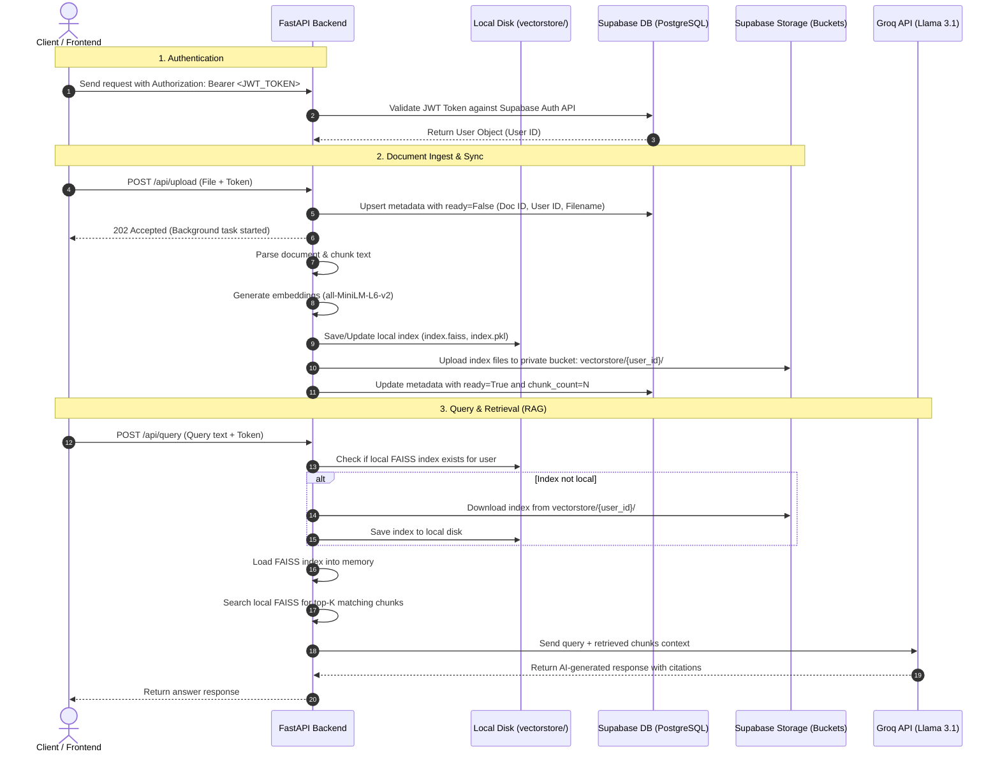

# 🧠 Documind: System Workflow & Supabase Integration Guide

This document provides a comprehensive overview of the **Documind** architecture, step-by-step data flows, and critical instructions to configure and debug your **Supabase** database/storage when hosting the application in cloud environments (e.g., Render, Railway, Heroku).

---

## 🗺️ System Architecture & Data Flow

Below is a visual overview of how the Frontend, FastAPI backend, local FAISS vector stores, and Supabase cloud services interact during runtime.



---

## 🛠️ Detailed Workflows

### 1. Authentication Workflow
*   **Sign In**: Users authenticate through Supabase Auth on the login page, receiving a JSON Web Token (JWT).
*   **Request Validation**: For secure routes (`/api/upload`, `/api/query`, `/api/documents`), the frontend attaches the header `Authorization: Bearer <jwt_token>`.
*   **Backend Resolution**: [auth.py](file:///c:/projects/rag1/backend/auth.py) extracts the token and uses the Supabase client to fetch the user profile. This guarantees that **user data is isolated**; all database records and storage structures partition under the specific `user_id`.

### 2. Document Ingestion & Storage Workflow
*   **Upload**: When a file is posted to `/api/upload`, a unique `doc_id` is generated. A database entry is created in `documents` with `ready=False`.
*   **Background Processing**: FastAPI spawns a background thread to prevent client timeouts:
    1.  The document is loaded and split into semantic chunks via recursive character text splitting.
    2.  Text chunks are embedded using `sentence-transformers/all-MiniLM-L6-v2`.
    3.  A FAISS vector store is initialized or updated locally on disk at `vectorstore/{user_id}/faiss_index`.
    4.  **Supabase Sync**: The local files (`index.faiss` and `index.pkl`) are uploaded to the private Supabase Storage bucket named `vectorstore` at the path `{user_id}/index.faiss` and `{user_id}/index.pkl`.
    5.  The database record is updated to `ready=True` along with the calculated `chunk_count`.

### 3. Query & Retrieval (RAG) Workflow
*   **Search**: When `/api/query` is invoked, the backend retrieves the vector store.
*   **Ephemeral Restoration**: If the server restarted and the local file is missing, the backend downloads the user's index files from the Supabase bucket `vectorstore` and restores them locally.
*   **Contextual Answer**: The query is embedded, similar chunks are retrieved, and a prompt containing the context is sent to Groq (`Llama 3.1 8B`) to output a response.

---

## 💾 Supabase Setup Requirements (SQL & Storage)

For the cloud storage integration to function, you must set up the database tables and storage buckets in your Supabase project dashboard.

### 1. Database Table: `documents`
Run the following SQL script in the **SQL Editor** of your Supabase Dashboard:

```sql
-- Create the documents tracking table
CREATE TABLE IF NOT EXISTS public.documents (
    doc_id text PRIMARY KEY,
    user_id uuid NOT NULL, -- references auth.users(id) for security
    filename text NOT NULL,
    chunk_count integer DEFAULT 0,
    ready boolean DEFAULT false,
    created_at timestamp with time zone DEFAULT timezone('utc'::text, now()) NOT NULL
);

-- Enable Row Level Security (RLS)
ALTER TABLE public.documents ENABLE ROW LEVEL SECURITY;

-- Enable users to read only their own documents
CREATE POLICY "Allow users to read their own documents" 
ON public.documents 
FOR SELECT 
USING (auth.uid() = user_id);

-- Enable users to delete only their own documents
CREATE POLICY "Allow users to delete their own documents" 
ON public.documents 
FOR DELETE 
USING (auth.uid() = user_id);

-- (Optional) If you want the backend to bypass RLS, use the service role key. 
-- Otherwise, you must create INSERT and UPDATE policies for authenticated users:
CREATE POLICY "Allow authenticated inserts" 
ON public.documents 
FOR INSERT 
WITH CHECK (auth.uid() = user_id);

CREATE POLICY "Allow authenticated updates" 
ON public.documents 
FOR UPDATE 
USING (auth.uid() = user_id);
```

### 2. Storage Bucket: `vectorstore`
1.  Navigate to **Storage** in the Supabase Dashboard.
2.  Click **New Bucket**.
3.  Name the bucket `vectorstore`.
4.  **Important**: Keep the bucket **Private** to protect proprietary documents.
5.  If you are not using the Service Role Key, click on the bucket's **Policies** tab and add access policies allowing `authenticated` users to upload, update, download, and delete files where the folder path starts with their `auth.uid()`.

---

## 🔍 Why Supabase Stores Fail in Production (Troubleshooting Guide)

If the application works locally but fails to persist data when hosted (e.g., on Render), verify the following common causes:

### 1. Missing or Misconfigured Environment Variables
*   Local environments load credentials from the `.env` file. **Hosted containers do not read `.env`** unless you configure those variables in your hosting provider's panel.
*   Make sure you have set the following environment variables in your deployment dashboard:
    *   `SUPABASE_URL` (e.g., `https://xyz.supabase.co`)
    *   `SUPABASE_KEY` (The public/anon key)
    *   `SUPABASE_SERVICE_KEY` (The **service\_role** key)
    *   `GROQ_API_KEY`

### 2. The `SUPABASE_SERVICE_KEY` is Required for Ephemeral Systems
*   In [supabase_store.py](file:///c:/projects/rag1/backend/supabase_store.py), the client configuration prefers `SUPABASE_SERVICE_KEY` over `SUPABASE_KEY` for backend operations.
*   **The Issue**: If you only provide the public `anon` key (`SUPABASE_KEY`), any write operation (like uploading to a private bucket or upserting to a table) will be rejected by Supabase's default security configuration (Row Level Security) unless you have written permissive RLS policies.
*   **The Fix**: Provide your project's **Service Role Key** under `SUPABASE_SERVICE_KEY` on your hosting platform. This admin key bypasses RLS and allows backend scripts to safely manage files and metadata on behalf of users.

### 3. Missing Database Schema or Storage Bucket
*   If you haven't created the `documents` table or the `vectorstore` bucket, backend network calls will return `404 Not Found` or `400 Bad Request`.
*   Check the API logs on your hosting dashboard. Look for exceptions thrown from `upsert_document` or `upload_index`.

### 4. How to Run Connectivity Diagnostics
You can query the app's health and connection status by visiting the debug endpoint in your browser or via `curl`:
```bash
# Verify connection to Supabase database & storage
GET https://your-hosted-app.com/api/debug
```
It returns a JSON payload detailing whether connection to the database (`db: true`) and storage bucket (`storage: true`) is working, along with any error logs. Use these errors to diagnose authentication issues.
